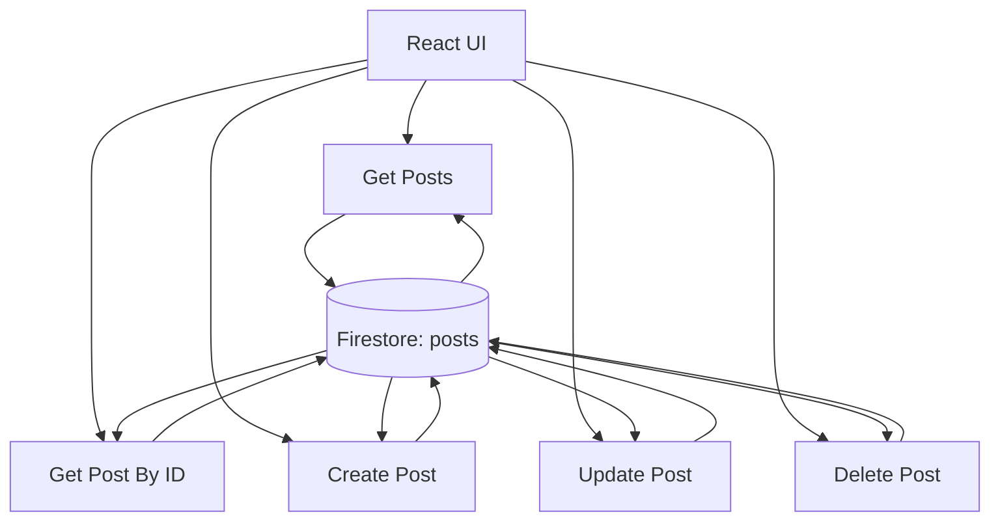
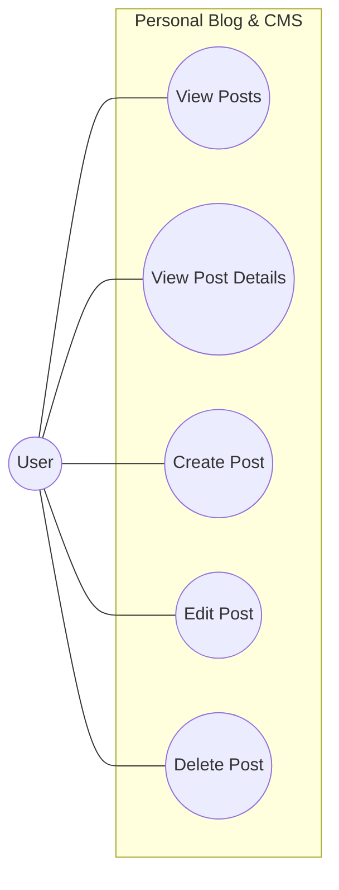
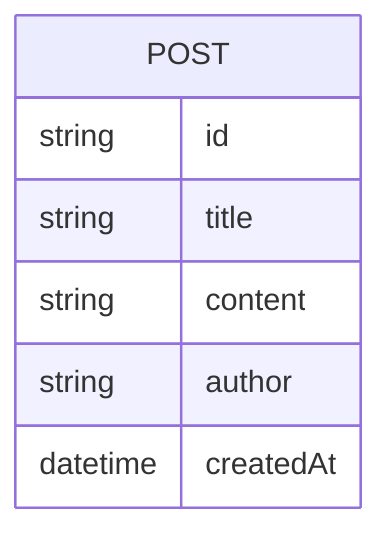
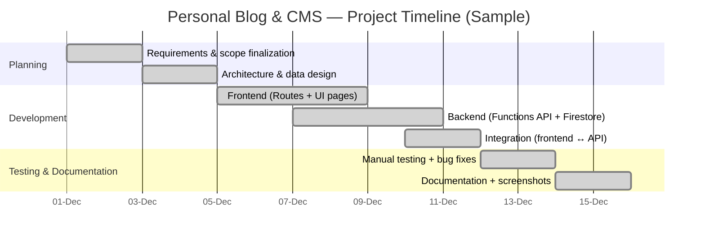
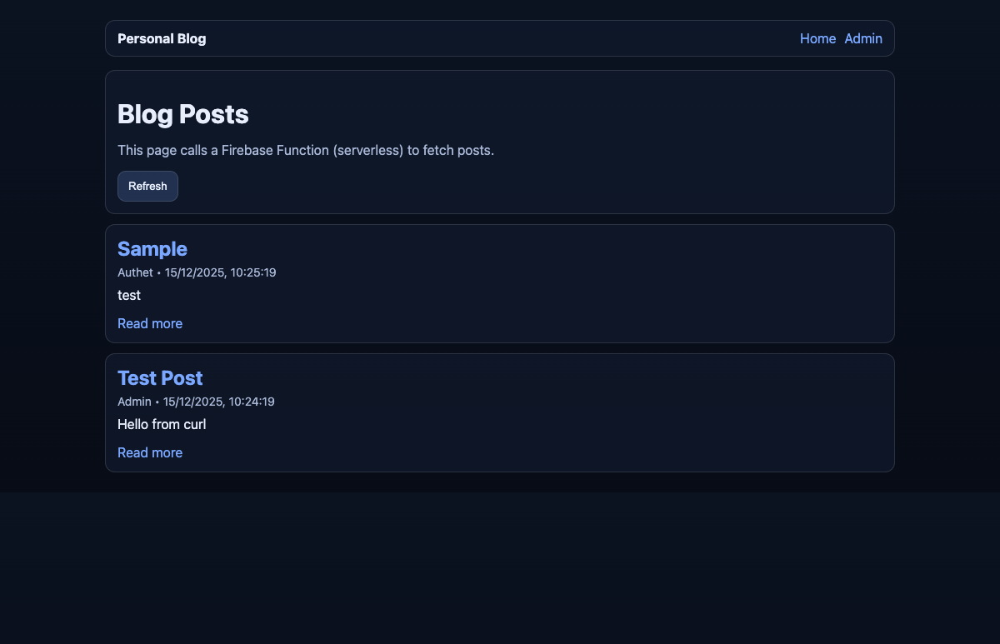
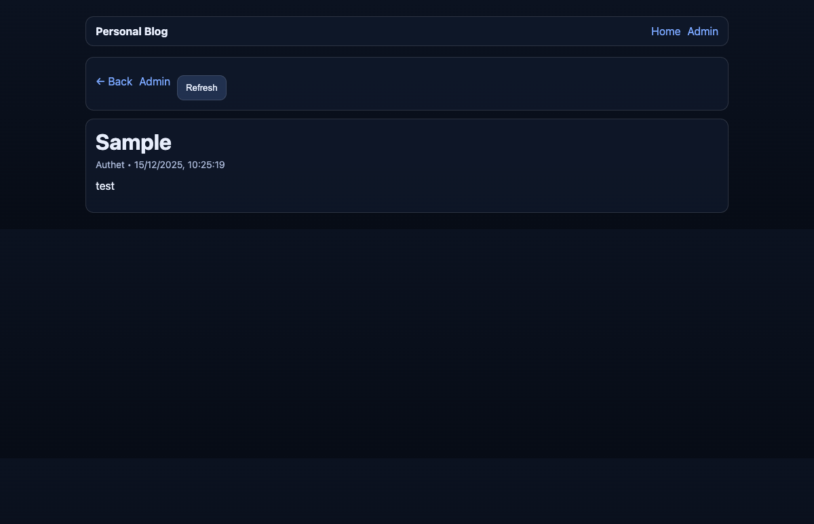
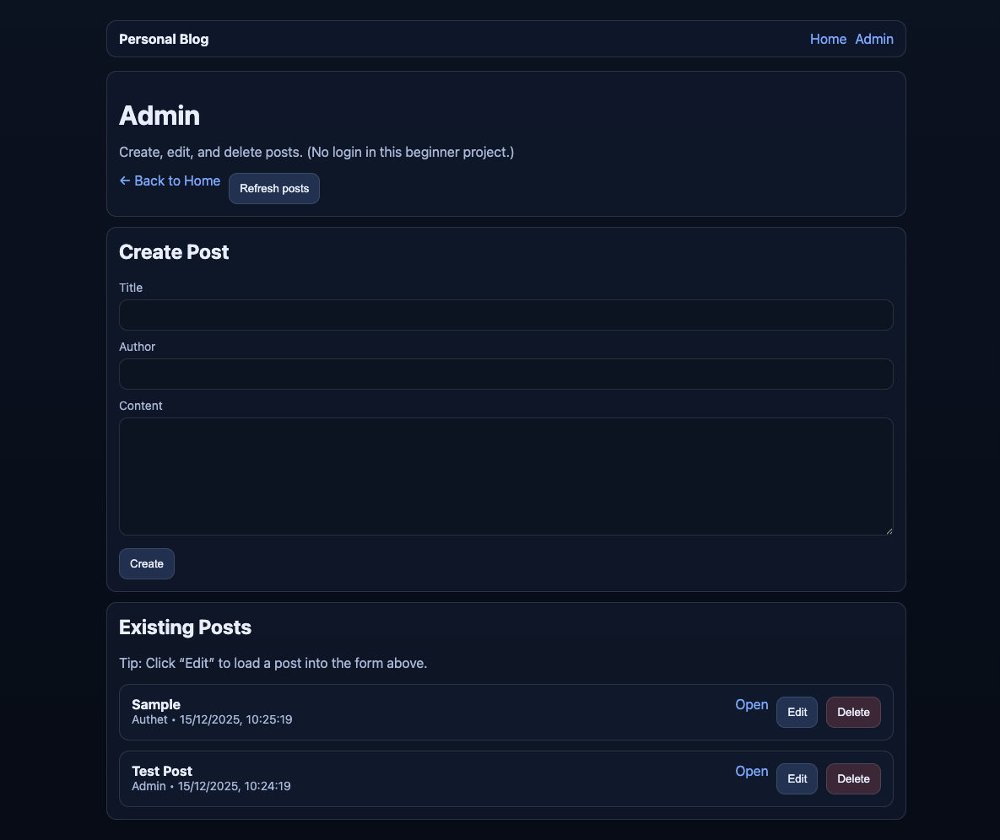
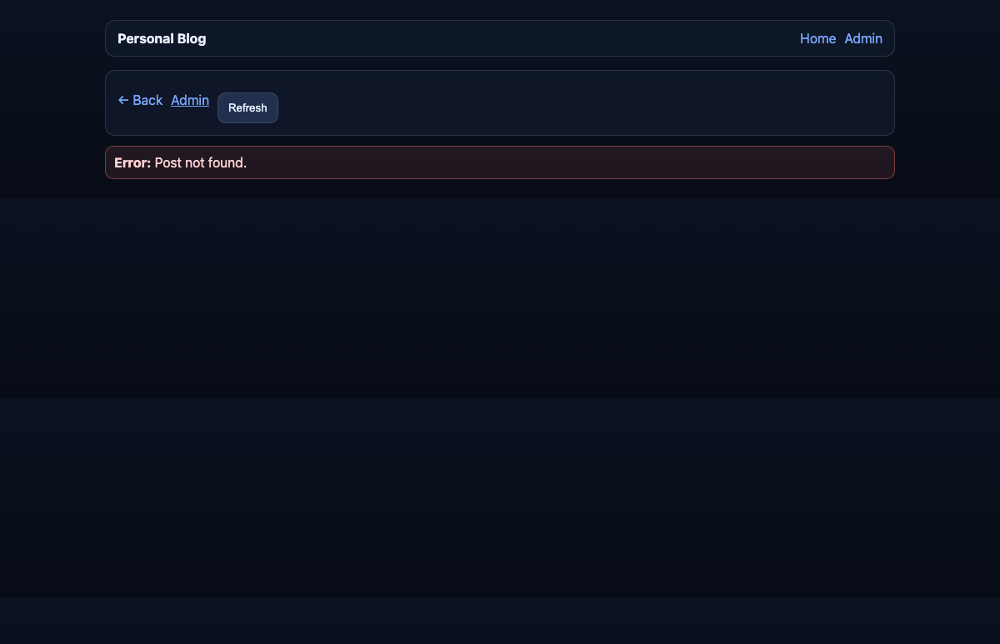

# Personal Blog & Content Management Platform
## A Serverless Web-Based Blogging & CRUD Content Management System (Firebase + React)

---

**Project Report**

Submitted in partial fulfillment of the requirements for the degree of  
\[Your Degree Name\]

**Student Name:** \[Your Name\]  
**Student ID:** \[Your ID\]  
**Institution:** \[Your Institution Name\]  
**Department:** \[Your Department\]  
**Date:** Monday Dec 15, 2025

---

# Acknowledgement

I would like to express my sincere gratitude to **[Supervisor/Guide Name]** for valuable guidance and feedback throughout the development of this project. I also thank **[Department/Institution Name]** for providing the opportunity and resources to complete this work. Finally, I acknowledge my friends and family for their encouragement and support.

---

# Table of Contents

1. [Acknowledgement](#acknowledgement)
2. [Abstract](#abstract)
3. [Introduction](#introduction)
4. [Problem Definition & Project Scope](#problem-definition--project-scope)
5. [Problem Statement](#problem-statement)
6. [Objectives](#objectives)
7. [Methodology](#methodology)
8. [Literature Review / Related Work](#literature-review--related-work)
9. [System Requirements](#system-requirements)
10. [Hardware Requirements](#hardware-requirements)
11. [System Architecture & Design](#system-architecture--design)
12. [DFD / Use-Case Diagram / ER Diagram](#dfd--use-case-diagram--er-diagram)
13. [Gantt Chart / Timeline](#gantt-chart--timeline)
14. [Technology Stack](#technology-stack)
15. [Implementation Details](#implementation-details)
16. [Features](#features)
17. [User Interface Design](#user-interface-design)
18. [Testing](#testing)
19. [Results & Screenshots](#results--screenshots)
20. [Challenges & Solutions](#challenges--solutions)
21. [Future Enhancements](#future-enhancements)
22. [Conclusion](#conclusion)
23. [References](#references)
24. [Appendix](#appendix)

---

# Abstract

This project implements a **Personal Blog & Content Management Platform** that allows users to **create, read, update, and delete (CRUD)** blog posts through a simple web interface. The system uses a **React** single-page frontend and a **serverless backend** implemented with **Firebase Cloud Functions (v2)**. Blog content is stored in **Firebase Firestore**, a NoSQL document database.

The application is intentionally built in a **beginner-friendly learning mode**: the backend exposes REST-style HTTP endpoints (e.g., `GET /getPosts`, `POST /createPost`) via a single exported Cloud Function named `api`, and Firestore security rules are configured for open read/write access (appropriate for learning, unsafe for production). The frontend does **not** connect directly to Firestore; instead it calls the Functions API using `fetch()` through a small helper module, demonstrating a clean separation between UI and data access logic.

Core pages include **Home** (listing and previewing posts), **Post Details** (viewing a full post), and **Admin** (creating, editing, and deleting posts). The backend validates required fields, uses server-side timestamps for consistent post creation times, and returns JSON responses suitable for frontend consumption. The project demonstrates modern web development concepts such as SPA routing, asynchronous data loading, REST-style API design, serverless deployment, and Firestore data modeling.

---

# Introduction

## Background

Blogging platforms and content management systems (CMS) are widely used to publish articles, tutorials, announcements, and documentation. A minimal CMS demonstrates core full-stack concepts: data modeling, CRUD operations, and a user interface that consumes an API.

Serverless platforms (e.g., Firebase Cloud Functions) reduce operational overhead by removing the need to manage servers. Developers deploy small backend functions that run on demand and scale automatically, enabling faster prototyping and simpler infrastructure.

## Purpose of the Project

The goal of this project is to build a simple but complete **blog + admin CMS** using:

- A modern **React** frontend with page routing
- A **serverless REST API** using Firebase Functions (Express on HTTPS Function)
- A persistent **NoSQL database** using Firestore

This project serves as a learning platform for:

- CRUD design and implementation (create/read/update/delete)
- React state management and lifecycle (`useState`, `useEffect`)
- Client-server communication with `fetch()` and JSON
- Firestore collections/documents and timestamps
- Serverless deployment and local emulation

## Scope and Limitations

### Scope

- Create and manage blog posts (title, author, content)
- Browse posts on Home and open individual posts
- Admin page to create/edit/delete posts
- Local development with Firebase emulators
- Deploy backend Functions to Firebase for production use

### Limitations

- **No authentication/authorization** (Admin page is open)
- Firestore rules allow universal read/write (learning mode)
- No rich text editor; content is plain text (supports multiline)
- No search, categories, tags, comments, or media uploads
- No post publishing workflow (draft/published), versioning, or audit logs

---

# Problem Definition & Project Scope

## Problem Definition

Beginners often need a project that demonstrates real-world full-stack fundamentals (CRUD + UI + database) without the complexity of managing servers, deployments, and infrastructure. A blog/CMS is a practical domain where users can create, view, edit, and delete content, making it ideal for learning end-to-end application flow.

## Project Scope

### In-Scope

- Create, view, update, and delete posts using a web UI (Admin page)
- List and read posts as a user (Home + Post Details pages)
- Store data in Firestore (`posts` collection)
- Expose CRUD functionality through a serverless REST API (Firebase Functions + Express)
- Run locally using Firebase emulators and the React dev server

### Out-of-Scope

- Authentication/authorization and role-based access control
- Search, tags/categories, comments, likes, pagination
- Rich-text editor and media uploads
- Production-grade validation and moderation workflows

---

# Problem Statement

## Real-World Problem

Creating and managing content typically requires:

- A reliable storage system for posts
- An interface to create and edit content
- A public-facing view for readers
- A backend that enforces a clean data flow and supports future growth

Beginners often struggle with full-stack complexity: deploying servers, configuring databases, writing APIs, and connecting a frontend to backend services.

## Need for a Serverless Blog + CMS

This project addresses the need for a minimal, understandable system that:

- Demonstrates end-to-end CRUD over HTTP
- Uses a managed database (Firestore) for persistent storage
- Uses serverless functions to avoid server management
- Provides a clean UI to test and verify backend operations

---

# Objectives

## Primary Objectives

1. **Build a React Single-Page Application (SPA)** with three routes: Home, Post Details, and Admin.
2. **Implement a REST-style serverless backend** using Firebase Functions + Express.
3. **Use Firestore as the database** to persist posts in a `posts` collection.
4. **Support complete CRUD operations**: create, list, view details, update, and delete posts.
5. **Provide basic validation and error handling** in both frontend and backend.

## Secondary Objectives

1. **Local development workflow** using Firebase emulators (Functions + Firestore).
2. **Maintainable structure**: keep API calls in a dedicated `frontend/src/api.js`.
3. **Beginner readability**: clear code comments and simple UI.

## Success Criteria

- ✅ Posts can be created from Admin and appear on Home
- ✅ Posts can be opened on Post Details (`/post/:id`)
- ✅ Posts can be edited and deleted from Admin
- ✅ Backend provides correct status codes and error messages
- ✅ App runs locally with emulators and can be deployed to Firebase

---

# Methodology

This project follows an iterative methodology aligned with a simplified Software Development Life Cycle (SDLC):

1. **Requirement Analysis**
   - Identify core entities and actions: Post CRUD + list/details views.
2. **System Design**
   - Choose a client-server architecture: React SPA + serverless REST API.
   - Define Firestore data model (`posts`) and API endpoints.
3. **Implementation**
   - Build UI pages and routing (Home, Post Details, Admin).
   - Implement backend routes in Express and deploy via Firebase Functions v2.
4. **Integration**
   - Connect frontend to backend using a single API helper (`frontend/src/api.js`).
   - Configure environment-based base URL (`REACT_APP_FUNCTIONS_BASE_URL`).
5. **Testing**
   - Perform manual functional and error-handling tests.
   - Validate responses and UI state for success/failure paths.
6. **Documentation**
   - Prepare the report with architecture, endpoints, test plan, results, and screenshots.

---

# Literature Review / Related Work

## Overview of Blog/CMS Architectures

Common architectures for blogging systems include:

1. **Traditional server-based CMS**: a backend server (Node/Express, Django, etc.) + database (SQL/NoSQL) + frontend templates or SPA.
2. **Headless CMS**: a backend API and admin interface, consumed by a separate frontend (Next.js, React, etc.).
3. **Serverless CMS**: REST or GraphQL endpoints hosted on managed serverless infrastructure (Firebase, AWS Lambda, etc.).

This project follows a **serverless headless** approach: the frontend consumes a backend API, and the backend performs all database operations.

## Firebase as a Serverless Platform

Firebase provides:

- **Firestore**: a document database (collections/documents) suitable for content objects (posts).
- **Cloud Functions**: event-driven/serverless functions that can expose HTTPS endpoints.
- **Emulators**: local development environment that mimics production services.

The project intentionally uses open Firestore rules to simplify learning and highlight that **authentication and strict rules are required for real deployments**.

---

# System Requirements

## Functional Requirements

### FR1: View All Posts
- The system shall list posts ordered by newest first.
- The system shall show a preview of content on the Home page.

### FR2: View Single Post
- The system shall display a post based on the URL parameter `:id`.
- The system shall show title, author, created date, and full content.

### FR3: Create Post (Admin)
- The system shall allow creating a post with `title`, `author`, and `content`.
- The system shall save a server-generated timestamp at creation.

### FR4: Update Post (Admin)
- The system shall allow editing an existing post and saving updates.

### FR5: Delete Post (Admin)
- The system shall allow deleting a post by id after confirmation.

### FR6: Error Handling
- The system shall show clear error messages for failed API requests.
- The backend shall return meaningful HTTP status codes and JSON error messages.

## Non-Functional Requirements

### NFR1: Usability
- The UI shall be simple and understandable for beginner users.
- The app shall be navigable via links without full page reloads (SPA).

### NFR2: Reliability
- The app shall not crash when the backend returns errors.
- Backend shall handle invalid inputs gracefully.

### NFR3: Maintainability
- API calls shall be centralized in a single helper module.
- Backend routes shall be organized and readable.

### NFR4: Compatibility
- The app shall run in modern browsers (Chrome/Firefox/Safari/Edge).
- The app shall run locally using Firebase emulators.

## Software Requirements

### Frontend
- Node.js + npm
- React (Create React App)
- react-router-dom

### Backend
- Firebase CLI (`firebase-tools`)
- Firebase Cloud Functions (Node 18 runtime)
- Express + CORS
- Firebase Admin SDK

---

# Hardware Requirements

## Client-Side (End User)

- **Device**: Laptop/Desktop/Tablet (modern)
- **RAM**: 4 GB minimum (8 GB recommended)
- **Browser**: Latest Chrome/Firefox/Safari/Edge
- **Network**: Internet recommended (for Firebase services). In local emulator mode, the app can be used offline after dependencies are installed.

## Developer Machine (For Local Development)

- **CPU**: Dual-core or higher
- **RAM**: 8 GB minimum (recommended for running Node + emulators smoothly)
- **Storage**: 1 GB+ free (dependencies + emulator downloads)
- **JDK**: Java 21+ (required for Firestore Emulator)
- **Tools**: Node.js + npm, Firebase CLI

---

# System Architecture & Design

## High-Level Architecture (Serverless)

```
┌───────────────────────────┐
│        React SPA           │
│  (Home / Post / Admin)     │
└─────────────┬─────────────┘
              │  HTTPS (fetch)
              ▼
┌───────────────────────────┐
│ Firebase Cloud Function     │
│ exports.api = onRequest(app)│
│ (Express REST endpoints)    │
└─────────────┬─────────────┘
              │ Firestore Admin SDK
              ▼
┌───────────────────────────┐
│       Firestore DB          │
│     collection: posts       │
└───────────────────────────┘
```

## Frontend Design

The frontend is a React SPA with React Router routes:

- `/` → Home page (list and preview posts)
- `/post/:id` → Post details page (view a single post)
- `/admin` → Admin page (create, edit, delete posts)

API communication is centralized in `frontend/src/api.js`, which builds URLs from:

- `REACT_APP_FUNCTIONS_BASE_URL` (recommended)
- fallback placeholder: `http://127.0.0.1:5001/YOUR_PROJECT_ID/us-central1/api`

## Backend Design

The backend is a single HTTPS Function that hosts an Express app:

- Collection: `posts`
- Data shape:
  - `title` (string)
  - `content` (string)
  - `author` (string)
  - `createdAt` (Firestore server timestamp)

The backend exposes these endpoints (mounted under the Function `api`):

- `GET    /getPosts`
- `GET    /getPostById?id=POST_ID`
- `POST   /createPost` (JSON body)
- `PUT    /updatePost?id=POST_ID` (JSON body)
- `DELETE /deletePost?id=POST_ID`

## Data Flow

1. User loads Home/Admin/Post page.
2. React calls the appropriate endpoint via `fetch()`.
3. Firebase Function receives HTTPS request and runs Express handler.
4. Function reads/writes Firestore using Admin SDK.
5. Function returns JSON.
6. React updates UI state based on the response.

---

# DFD / Use-Case Diagram / ER Diagram

> **Note**: Diagrams below are provided using **Mermaid**. If your college requires image-based diagrams, export these to PNG and paste them here.

## DFD (Level 0) — Context Diagram

```mermaid
flowchart LR
  U[User] -->|View/Create/Edit/Delete Requests| UI[React Web App]
  UI -->|UI Response| U

  UI -->|HTTPS Requests| API[Firebase Functions API (Express)]
  API -->|JSON Responses| UI

  API -->|Read/Write| DB[(Firestore: posts)]
  DB -->|Post Data| API
```

## DFD (Level 1) — Post CRUD Processes



## Use-Case Diagram



## ER Diagram (Firestore Data Model)



---

# Gantt Chart / Timeline



---

# Technology Stack

## Frontend

- **React (CRA)**: SPA UI and component rendering
- **React Router DOM**: client-side routing (`Routes`, `Route`, `Link`, `useParams`)
- **Fetch API**: network requests to backend
- **Plain CSS**: custom styling in `frontend/src/index.css`

## Backend (Serverless)

- **Firebase Cloud Functions v2**: HTTPS function via `onRequest`
- **Express.js**: REST-style routing and middleware
- **CORS**: cross-origin support for local dev and deployments
- **firebase-admin**: Firestore Admin SDK access
- **Firestore**: NoSQL document database

## Development / Tooling

- **Firebase CLI**: emulation and deployment (`firebase emulators:start`, `firebase deploy`)
- **Firebase Emulators**:
  - Functions emulator on `localhost:5001`
  - Firestore emulator on `localhost:8080`
  - Emulator UI enabled

---

# Implementation Details

## Frontend Implementation

### Routing

Routing is defined in `frontend/src/App.jsx` with:

- Home: `/`
- Post details: `/post/:id`
- Admin: `/admin`
- Fallback route for unknown pages

### API Helper

`frontend/src/api.js` implements a `request()` helper that:

- Builds the URL from `BASE_URL + path`
- Sends JSON headers
- Parses JSON response
- Throws a readable Error when response is not OK

Exposed functions:

- `getPosts()`
- `getPostById(id)`
- `createPost(post)`
- `updatePost(id, post)`
- `deletePost(id)`

### UI Data Loading

- Home page calls `getPosts()` on mount and shows preview of post content.
- Post page reads `:id` via `useParams()` and fetches details via `getPostById(id)`.
- Admin page fetches posts, supports editing by loading a post into the form, and performs create/update/delete operations.

## Backend Implementation (Firebase Functions + Express)

### Express Setup

- `cors({ origin: true })` allows cross-origin requests.
- `express.json()` parses JSON bodies.
- Firestore access via `admin.initializeApp()` and `admin.firestore()`.

### Endpoints

- **GET `/getPosts`**
  - Queries `posts` collection, ordered by `createdAt desc`
  - Converts `createdAt` timestamp to ISO string for the frontend
  - Returns: `{ posts: [...] }`

- **GET `/getPostById?id=POST_ID`**
  - Validates `id` query param
  - Returns 404 if not found
  - Returns: `{ post: {...} }`

- **POST `/createPost`**
  - Validates presence of `title`, `content`, and `author`
  - Stores `createdAt` using `FieldValue.serverTimestamp()`
  - Returns: `{ id: NEW_POST_ID }` with status 201

- **PUT `/updatePost?id=POST_ID`**
  - Validates `id` and required fields
  - Ensures document exists before update
  - Returns: `{ ok: true }`

- **DELETE `/deletePost?id=POST_ID`**
  - Validates `id`
  - Ensures document exists before delete
  - Returns: `{ ok: true }`

### Firestore Rules (Learning Mode)

In `firebase/firestore.rules`, read/write is allowed for everyone:

- **Purpose**: remove auth complexity for learning CRUD
- **Risk**: unsafe for production without authentication and validation

---

# Features

## Core Features

1. **Post Listing (Home)**
   - Fetches all posts (newest first)
   - Displays title, author, date, and content preview

2. **Post Details View**
   - Opens a post by id from the URL
   - Shows full content with preserved line breaks

3. **Admin CRUD**
   - Create posts
   - Edit existing posts by loading data into the form
   - Delete posts with confirmation

4. **Serverless REST API**
   - Firebase Function exposes Express endpoints
   - Firestore operations performed only by backend

5. **Beginner-Friendly Error Handling**
   - UI shows errors when requests fail
   - Backend returns clear JSON error messages

---

# User Interface Design

## UI/UX Description

The UI is intentionally simple and readable, with a dark theme:

- Navigation header with **Home** and **Admin**
- Card-based layout for sections and posts
- Buttons for refresh/create/update/delete actions
- Error panel for request failures

## Pages

### Home (`/`)

- Header: “Blog Posts”
- Refresh button
- Post cards:
  - Title link (opens `/post/:id`)
  - Author + created date
  - Content preview + “Read more”

### Post Details (`/post/:id`)

- Back link to Home
- Admin link
- Refresh button
- Post content displayed with `whiteSpace: pre-wrap` to keep formatting

### Admin (`/admin`)

- Create/Edit form (title, author, content)
- Existing posts list with:
  - Open (view details)
  - Edit (load into form)
  - Delete (confirmation)

---

# Testing

## Testing Approach

Testing for this project can be performed primarily via:

- Manual testing through the UI (Home, Post, Admin pages)
- API testing using the emulator URLs (or deployed Function URLs)

## Suggested Test Cases

### Functional Testing

- **TC1: Create Post**
  - Input valid title/author/content
  - Expected: success message, post appears in list

- **TC2: List Posts**
  - Load Home page
  - Expected: posts displayed newest first

- **TC3: View Post Details**
  - Open `/post/:id`
  - Expected: correct post content loads

- **TC4: Update Post**
  - Click Edit in Admin, change values, submit
  - Expected: updated data appears in Home and Post details

- **TC5: Delete Post**
  - Delete from Admin and confirm
  - Expected: post removed from lists; fetching by id returns 404

### Error Handling Testing

- **TC6: Missing emulator/project id config**
  - Leave `REACT_APP_FUNCTIONS_BASE_URL` unset
  - Expected: requests fail with a clear error (until URL is configured)

- **TC7: Backend down**
  - Stop emulators and reload UI
  - Expected: UI shows error message without crashing

## Test Plan (Matrix) and Actual Results

| Test ID | Scenario | Steps (Summary) | Expected Result | Actual Result | Status |
|---|---|---|---|---|---|
| TP-01 | Load Home page | Open `/` | Posts load (or empty state) without errors | Posts loaded and displayed | Pass |
| TP-02 | Open Post Details | Click “Read more” on any post | Post details render with correct content | Post details rendered correctly | Pass |
| TP-03 | Create Post | Go to `/admin`, fill fields, click Create | Post created; appears in Existing Posts and Home | Post created and listed | Pass |
| TP-04 | Edit Post | Click Edit, modify fields, click Update | Post updated; changes reflected on Home/Post | Post updated correctly | Pass |
| TP-05 | Delete Post | Click Delete and confirm | Post removed; cannot be fetched by id | Post removed successfully | Pass |
| TP-06 | Invalid Post ID | Open `/post/does-not-exist` | Error shown (“Post not found.”) | Error shown as expected | Pass |
| TP-07 | Backend not running | Stop emulators, refresh UI | UI shows request error without crashing | Error displayed; UI stable | Pass |

---

# Results & Screenshots

This section includes **actual screenshots captured from the running application**. Image files are stored in the project’s `screenshots/` directory.

### Suggested Screenshots

- **Figure 1: Home Page (Post list)**



- **Figure 2: Post Details Page**



- **Figure 3: Admin Page (Create/Edit + Existing Posts list)**



- **Figure 4: Error State (Post not found)**



---

# Challenges & Solutions

## Challenge 1: Separating frontend UI from database access

**Problem**: Letting the frontend talk directly to Firestore complicates security and encourages mixing concerns.  
**Solution**: Centralize database logic in Firebase Functions and call it via a simple REST API (`frontend/src/api.js`).  
**Result**: Clear separation of concerns and an extensible backend boundary.

## Challenge 2: Cross-origin calls in development

**Problem**: React dev server and Functions emulator run on different origins/ports.  
**Solution**: Enable CORS in Express with `cors({ origin: true })`.  
**Result**: Browser requests succeed in local and deployed setups.

## Challenge 3: Consistent created timestamps

**Problem**: Client-generated timestamps can be inconsistent.  
**Solution**: Use `FieldValue.serverTimestamp()` on the backend when creating posts.  
**Result**: Post ordering and time display are reliable.

## Challenge 4: Beginner-mode security

**Problem**: Open Firestore rules are unsafe for production.  
**Solution**: Document this explicitly and keep it as a learning trade-off.  
**Result**: Easier onboarding while highlighting the correct production direction (Auth + strict rules).

---

# Future Enhancements

1. **Authentication & Authorization**
   - Add Firebase Auth, restrict Admin actions to authenticated users

2. **Secure Firestore Rules + Data Validation**
   - Validate fields and enforce ownership/roles

3. **Rich Text Editor**
   - Add Markdown or WYSIWYG editor for post content

4. **Draft/Publish Workflow**
   - Add `status` field and filter published posts on Home

5. **Search, Tags, Categories**
   - Add metadata to posts and implement filtering

6. **Image Uploads**
   - Integrate Firebase Storage for media

7. **Pagination**
   - Use Firestore pagination for large post collections

8. **Better UX**
   - Replace `alert()` with inline toasts, improved form validation, loading skeletons

---

# Conclusion

This project successfully delivers a beginner-friendly **Personal Blog & CMS** demonstrating full-stack CRUD using a modern **React SPA** and a **serverless Firebase backend**. The design cleanly separates UI concerns from database access by routing all data operations through Firebase Functions, enabling a clear path toward production hardening (authentication, stricter rules, and validation). The project provides a strong foundation for expanding into a more complete blogging platform with security and advanced publishing features.

---

# References

1. React Documentation: `https://react.dev`
2. React Router Documentation: `https://reactrouter.com`
3. Firebase Documentation: `https://firebase.google.com/docs`
4. Cloud Functions for Firebase (v2): `https://firebase.google.com/docs/functions`
5. Cloud Firestore Documentation: `https://firebase.google.com/docs/firestore`
6. Express Documentation: `https://expressjs.com`

---

# Appendix

## Appendix A: Project Structure

```
firebase/
  firebase.json
  firestore.rules
  sampleData.json
  functions/
    index.js
    package.json

frontend/
  package.json
  public/
    index.html
  src/
    App.jsx
    api.js
    index.css
    index.js
    main.jsx
    pages/
      Home.jsx
      Post.jsx
      Admin.jsx
```

## Appendix B: Local Setup (Recommended)

### 1) Install Firebase CLI

```bash
npm install -g firebase-tools
```

### 2) Login and select a Firebase project

```bash
firebase login
cd firebase
firebase use --add
```

### 3) Install backend dependencies

```bash
cd firebase/functions
npm install
```

### 4) Start emulators (Functions + Firestore)

```bash
cd firebase
firebase emulators:start
```

### 5) Install frontend dependencies

```bash
cd frontend
npm install
```

### 6) Configure frontend to call Functions emulator

Create `frontend/.env`:

```bash
REACT_APP_FUNCTIONS_BASE_URL=http://127.0.0.1:5001/YOUR_PROJECT_ID/us-central1/api
```

### 7) Start the frontend

```bash
cd frontend
npm start
```

## Appendix C: Backend API Summary

Base URL (emulator example):

```text
http://127.0.0.1:5001/YOUR_PROJECT_ID/us-central1/api
```

Endpoints:

- `GET    /getPosts`
- `GET    /getPostById?id=POST_ID`
- `POST   /createPost` (JSON: `{ title, content, author }`)
- `PUT    /updatePost?id=POST_ID` (JSON: `{ title, content, author }`)
- `DELETE /deletePost?id=POST_ID`

---

**End of Document**


